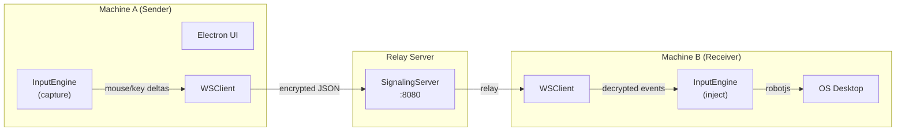
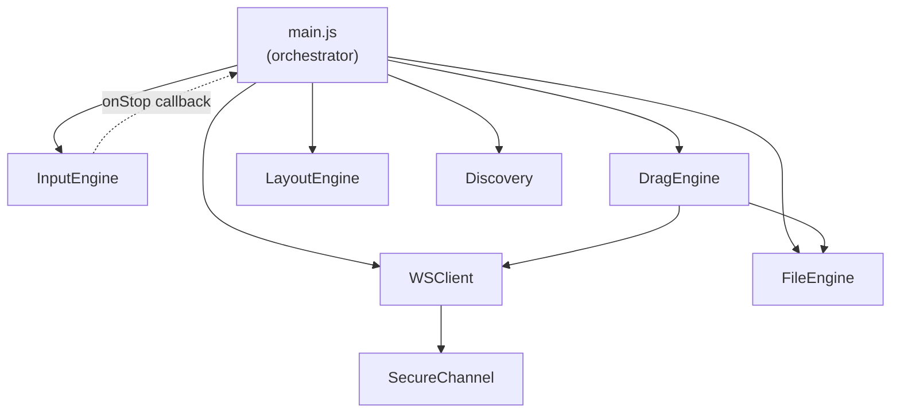

# 🔬 Omnibridge — Complete Codebase Analysis

---

## 1. PROJECT OVERVIEW

**What it does:** Omnibridge is a **cross-device mouse, keyboard, and file sharing tool** — essentially an open-source alternative to apps like Synergy, Barrier, or Logitech Flow. It lets you move your mouse cursor seamlessly from one computer to another over the local network, carrying keyboard input and file transfers with it.

**Problem it solves:** Eliminates the need for multiple keyboards/mice when working across multiple computers on the same desk/network.

**Target user:** Developers, power users, or anyone with multiple PCs on a LAN who want unified mouse/keyboard control.

**Tech stack:**

| Layer | Technology |
|-------|-----------|
| Desktop App Shell | **Electron** (v41.2) |
| Networking | **WebSocket** (`ws` library) — custom signaling server |
| Input Capture | **uiohook-napi** (global keyboard/mouse hooks) |
| Input Injection | **@jitsi/robotjs** (simulated mouse/keyboard on receiver) |
| Device Discovery | **bonjour-service** (mDNS/Zeroconf) |
| Encryption | **Node.js crypto** (AES-256-GCM) |
| Native Drag & Drop | **C++ N-API addon** (Windows OLE drag-drop) |
| UI | Vanilla HTML/CSS/JS inside Electron renderer |

---

## 2. FOLDER & FILE STRUCTURE

```
omnibridge/
├── apps/desktop/          # Electron app (UI + main process)
│   ├── main.js            # ★ Electron main process — orchestrator
│   ├── index.html         # ★ Renderer UI (inline JS)
│   ├── index.css          # Premium dark-glass UI styling
│   └── file-icon.png      # Icon used for native drag ghost
├── core/                  # Shared engine modules
│   ├── inputEngine.js     # ★ Global input capture & injection (mouse/kb)
│   ├── wsClient.js        # ★ WebSocket client with chunked file transfer
│   ├── discovery.js        # mDNS device discovery (Bonjour)
│   ├── dragEngine.js      # Cross-device native drag-and-drop orchestrator
│   ├── fileEngine.js      # File read/write/chunk utilities
│   ├── layoutEngine.js    # Screen boundary detection (left/right)
│   └── secureChannel.js   # AES-256-GCM encrypt/decrypt wrapper
├── native/                # C++ Node addon (Windows drag-drop)
│   ├── src/dragdrop.cpp   # ★ OLE IDropTarget/IDataObject/DoDragDrop
│   ├── binding.gyp        # node-gyp build config
│   └── package.json       # Native addon dependencies
├── server/
│   └── signaling.js       # ★ WebSocket signaling hub (relay server)
├── config/                # Empty — unused
├── dist/                  # Packaged Electron build output
├── package.json           # Root project config
└── package-lock.json      # Dependency lockfile
```

### Most Important Files (★)

| File | Role |
|------|------|
| [main.js](file:///c:/claude/omnibridge/apps/desktop/main.js) | App entry point. Wires all engines together, manages state transitions |
| [inputEngine.js](file:///c:/claude/omnibridge/core/inputEngine.js) | Captures local input → sends deltas; injects remote input events |
| [wsClient.js](file:///c:/claude/omnibridge/core/wsClient.js) | WebSocket communication + chunked file streaming |
| [signaling.js](file:///c:/claude/omnibridge/server/signaling.js) | Relay server — routes messages between peers |
| [dragdrop.cpp](file:///c:/claude/omnibridge/native/src/dragdrop.cpp) | Windows-native OLE drag-and-drop interception/initiation |

### Config Files

| File | Purpose |
|------|---------|
| `package.json` (root) | Scripts: `start`, `server`, `dev`, `package`. Dependencies. |
| `native/package.json` | Native addon build config (`node-gyp rebuild`) |
| `native/binding.gyp` | C++ compilation settings (MSVC, link libs) |

---

## 3. ARCHITECTURE & DESIGN PATTERNS

### Overall Architecture: **Peer-to-Peer with Central Relay**



- **Not true P2P** — all traffic passes through the signaling server (no WebRTC/NAT traversal)
- **Monolith codebase** organized by layer (core engines vs. app shell vs. server)
- Each machine runs the same Electron app; one also runs the signaling server

### Design Patterns

| Pattern | Where |
|---------|-------|
| **Event-driven / Observer** | `uIOhook` events, `ipcMain`/`ipcRenderer`, `Discovery extends EventEmitter` |
| **Strategy** | `InputEngine` switches between capture mode (sender) and inject mode (receiver) |
| **Facade** | `WSClient` wraps raw WebSocket with encrypt/decrypt/chunking |
| **Adapter** | `SecureChannel` adapts Node crypto into a simple encrypt/decrypt API |
| **Graceful degradation** | `DragEngine` falls back to stub if native addon not compiled |

### Code Organization: **By type/layer** (not by feature)

---

## 4. DATA FLOW

### Input Flow (Mouse/Keyboard)

```
1. User moves mouse on Machine A
2. uIOhook fires 'mousemove' → InputEngine calculates dx/dy delta
3. InputEngine calls onEvent callback → main.js sends via wsClient.sendEvent()
4. WSClient encrypts (AES-256-GCM) → JSON over WebSocket → Signaling Server
5. Server relays to Machine B's WSClient
6. WSClient decrypts → main.js receives → inputEngine.injectEvent()
7. robotjs.moveMouse() moves cursor on Machine B's OS
```

### Boundary Crossing (Local → Remote)

```
1. Polling interval (100ms) checks cursor position via screen.getCursorScreenPoint()
2. LayoutEngine.checkBoundary() detects cursor in right 30% zone
3. handleSystemSwitch('remote') called
4. InputEngine.startCapture() begins — cursor trapped at center, deltas forwarded
5. On receiver: if cursor hits x<=0, returns {action: 'switch-to-local'} → switches back
```

### File Transfer Flow

```
1. User drops file onto drop-zone in UI
2. Renderer sends 'send-file' IPC with file path
3. main.js reads file as base64 via FileEngine
4. WSClient.sendChunked() splits into 512KB chunks → encrypted → sent
5. Receiver reassembles chunks via FileEngine.appendChunk()
6. Ghost file icon appears in receiver UI → user can native-drag it out
```

### State Management

- **Global mutable variables** in `main.js`: `bridgeActive`, `currentSystem`, `capturing`
- No state management library — pure imperative state in the main process
- UI state synced via `ipcRenderer.on('system-switched', ...)` messages

---

## 5. CORE MODULES & KEY COMPONENTS

### InputEngine ([inputEngine.js](file:///c:/claude/omnibridge/core/inputEngine.js))
- **Capture mode**: Hooks global mouse/keyboard via `uiohook-napi`, traps cursor near center, emits deltas
- **Inject mode**: Receives events and replays them via `@jitsi/robotjs`
- **Escape hotkeys**: `Ctrl+Alt+Q` or `Escape` to break out of capture
- **Cursor trap**: Re-centers mouse when it strays >150px from center point
- **ClipCursor release**: Windows-specific P/Invoke to release OS cursor confinement

### WSClient ([wsClient.js](file:///c:/claude/omnibridge/core/wsClient.js))
- Connects to signaling server, sends/receives encrypted JSON messages
- Auto-reconnect (up to 5 attempts, 2s delay)
- `sendChunked()` for large files (512KB chunks with throttling)
- Peer locking: locks onto first peer that sends a message

### SignalingServer ([signaling.js](file:///c:/claude/omnibridge/server/signaling.js))
- Simple WebSocket relay hub on port 8080
- Assigns random IDs to clients
- Supports targeted routing (if `data.target` specified) or broadcast
- 256MB max payload for large file chunks

### SecureChannel ([secureChannel.js](file:///c:/claude/omnibridge/core/secureChannel.js))
- AES-256-GCM encryption with `crypto.scryptSync` key derivation
- Random 12-byte IV per message
- Includes auth tag for integrity verification

### Discovery ([discovery.js](file:///c:/claude/omnibridge/core/discovery.js))
- mDNS service publishing and browsing via `bonjour-service`
- Emits `deviceFound` events with name/host/port
- Falls back to manual IP if Bonjour fails

### DragEngine ([dragEngine.js](file:///c:/claude/omnibridge/core/dragEngine.js))
- Orchestrates cross-device native drag-and-drop
- **Sender**: Detects drag crossing edge window → streams files as base64 chunks
- **Receiver**: Reassembles files in temp dir → triggers native `DoDragDrop` via C++ addon

### FileEngine ([fileEngine.js](file:///c:/claude/omnibridge/core/fileEngine.js))
- File I/O utilities: read as base64, save temp files, append chunks
- Uses Electron's `app.getPath('userData')` for storage

### LayoutEngine ([layoutEngine.js](file:///c:/claude/omnibridge/core/layoutEngine.js))
- Manages virtual screen layout (which peer is left/right)
- Zone-based boundary detection (not edge-based): right 30%, left 30%

### Native Drag-Drop Addon ([dragdrop.cpp](file:///c:/claude/omnibridge/native/src/dragdrop.cpp))
- Windows COM/OLE implementation
- `EdgeDropTarget`: IDropTarget registered on a 1px invisible window at screen edge
- `SimpleDataObject` / `SimpleDropSource`: Implements OLE DoDragDrop for receiver-side
- Uses `Napi::ThreadSafeFunction` for safe JS callback from COM thread

### Inter-module Communication



All communication is via **direct function calls** and **callbacks** — no event bus or pub/sub between core modules (except Discovery which uses EventEmitter).

---

## 6. EXTERNAL INTEGRATIONS & DEPENDENCIES

### Critical npm Packages

| Package | Purpose | Why Critical |
|---------|---------|-------------|
| `electron` (v41.2) | Desktop app shell, windowing, IPC | The entire app framework |
| `@jitsi/robotjs` (v0.6.21) | Simulate mouse/keyboard on receiver | Core injection capability |
| `uiohook-napi` (v1.5.5) | Global input hooks (capture mode) | Core capture capability |
| `ws` (v8.16) | WebSocket client + server | All network communication |
| `bonjour-service` (v1.2.1) | mDNS/Zeroconf device discovery | Auto-find peers on LAN |
| `express` (v4.18.2) | HTTP server framework | **Listed but unused in code** |
| `electron-packager` (v17.1.2) | Package app for distribution | Build tooling |
| `node-addon-api` (v8.0) | C++ ↔ JS bridge (N-API) | Native drag-drop addon |

### Notable Flags

> [!WARNING]
> `express` is listed as a dependency but **never imported or used** anywhere in the codebase. It's dead weight.

> [!IMPORTANT]
> `@jitsi/robotjs` and `uiohook-napi` are **native modules** that require compilation. They can cause build issues across platforms/Node versions.

---

## 7. DATABASE & DATA MODELS

**No database.** All state is in-memory. File transfers are stored to disk at:
- `app.getPath('userData')/received_files/` (permanent received files)
- `os.tmpdir()/OmnibridgeDrag/` (temporary drag-drop staging)

### Implicit Data Models

| Entity | Shape | Storage |
|--------|-------|---------|
| Peer Connection | `{ myId, targetId, serverUrl }` | In-memory (WSClient) |
| Device | `{ name, host, port, position }` | In-memory (LayoutEngine.systems[]) |
| Input Event | `{ type, dx, dy, key, button, delta }` | Transient (WebSocket messages) |
| File Chunk | `{ type, fileName, data, chunkIndex, totalChunks }` | Transient → disk |
| Drag Session | `{ sessionId, files[], receivedFiles[] }` | In-memory + temp disk |

---

## 8. AUTHENTICATION & AUTHORIZATION

### Encryption

- **AES-256-GCM** symmetric encryption on all WebSocket messages
- Key derived via `crypto.scryptSync(secret, 'salt', 32)`

### Auth Concerns

> [!CAUTION]
> - **Hardcoded secret**: `DEFAULT_SECRET = 'super-secret-key'` in [main.js:40](file:///c:/claude/omnibridge/apps/desktop/main.js#L40)
> - **Hardcoded salt**: `'salt'` in scryptSync — completely defeats key derivation security
> - **No authentication handshake** — any client with the secret can connect
> - **No per-session key exchange** — same key used for all sessions forever
> - **No user roles or permissions** — full control is granted to any connected peer

---

## 9. ERROR HANDLING & LOGGING

### Error Handling Strategy
- **Try-catch wrappers** around most critical operations (injection, native addon calls, crypto)
- **Graceful degradation**: Native addon fails → stub mode; Bonjour fails → manual IP only
- **Multiple shutdown hooks**: `window-all-closed`, `before-quit`, `quit`, `process.exit`, `uncaughtException`, `unhandledRejection` all call `inputEngine.stop()` + `releaseClipCursor()`
- **No centralized error handler** — each module handles its own errors

### Logging
- Pure `console.log` / `console.error` / `console.warn`
- Prefixed with module names like `[DragEngine]`, `[InputEngine]`, `[Main]`
- No log levels, no log files, no structured logging

---

## 10. TESTING STRATEGY

> [!CAUTION]
> **There are zero tests.** No test files, no test framework, no test scripts in package.json. The entire codebase is untested.

---

## 11. ENTRY POINTS & BOOTSTRAPPING

### Startup Sequence

1. `npm start` → runs `electron .` → Electron loads `apps/desktop/main.js` (from `package.json` "main")
2. `app.disableHardwareAcceleration()` + GPU switches set
3. `app.whenReady()` → `createWindow()`
4. `releaseClipCursor()` (cleanup from potential previous crash)
5. `BrowserWindow` created (1000×800, frameless, dark bg)
6. `index.html` loaded into renderer
7. `discovery.start(8080)` begins mDNS broadcasting
8. `wsClient.connect()` connects to hardcoded signaling server IP
9. 100ms polling interval starts watching cursor position
10. User clicks "INITIALIZE ENGINE" → `bridgeActive = true` → edge window created

### Server Entry
- `npm run server` → runs `node server/signaling.js`
- Creates `WebSocketServer` on port 8080 + prints local IP addresses

### Required Environment
- **Windows** (native addon is Windows-only, ClipCursor is Windows-only)
- **Node.js** with native build tools (for robotjs, uiohook-napi, native addon)
- **Signaling server** must be running and accessible on the LAN
- **Hardcoded IP** `192.168.1.36` in [main.js:39](file:///c:/claude/omnibridge/apps/desktop/main.js#L39) must match actual server

---

## 12. THINGS TO WATCH OUT FOR

### 🔴 Security Concerns
1. **Hardcoded encryption secret** — trivially breakable
2. **Hardcoded salt** — rainbow table vulnerable
3. **`contextIsolation: false`** + **`nodeIntegration: true`** — XSS → full system RCE
4. **`no-sandbox`** flag — disables Electron's sandbox protection
5. **No input validation** on received events — a malicious peer could inject arbitrary keystrokes

### 🟡 Code Smells & Tech Debt
1. **Hardcoded signaling server IP** (`192.168.1.36`) — breaks on any other network
2. **Inline JavaScript** in `index.html` (~160 lines) — should be a separate renderer.js
3. **`express` dependency** is imported but never used
4. **No config file** — `config/` directory exists but is empty
5. **Global mutable state** in main.js (`bridgeActive`, `currentSystem`, `capturing`)
6. **Layout zone detection** uses 30%/70% thresholds instead of actual screen edges — will cause accidental triggers
7. **`DragEngine`** creates a new `FileEngine` instance per `streamFiles` call instead of reusing one
8. **The `_releaseClipCursor` method exists in both** `inputEngine.js` AND `main.js` (duplicated code)

### 🟠 Fragile Areas
1. **Cursor trap** relies on timing (`setTimeout 50ms`) for re-centering detection
2. **Peer locking** — first peer to respond is permanently locked as target; no way to switch
3. **Chunked transfer** has no checksums/integrity verification per chunk
4. **No backpressure** — sender can overwhelm receiver's WebSocket buffer
5. **100ms polling** for boundary detection creates noticeable latency vs. edge-triggered approach

---

## 13. WHAT IS ALREADY IMPLEMENTED

### Core Features

| Feature | Status | Notes |
|---------|--------|-------|
| Mouse capture (sender) | ✅ Complete | Delta calculation, center-trap, re-centering guard |
| Mouse injection (receiver) | ✅ Complete | robotjs.moveMouse with boundary clamping |
| Keyboard capture/injection | ✅ Complete | Full key map (A-Z, 0-9, F1-F12, modifiers, symbols) |
| Mouse button events | ✅ Complete | Left/right/middle down/up |
| Mouse wheel events | ✅ Complete | Scroll forwarding |
| Escape hotkeys | ✅ Complete | Ctrl+Alt+Q and Escape key |
| Boundary detection (local→remote) | 🔶 Partial | Zone-based (30%/70%), not edge-based. Accidental triggers likely |
| Boundary detection (remote→local) | 🔶 Partial | Only left-edge (x<=0) sends switch-to-local |

### Networking

| Feature | Status | Notes |
|---------|--------|-------|
| WebSocket signaling server | ✅ Complete | Relay + targeted routing + broadcast |
| WebSocket client | ✅ Complete | Connect, send, receive, auto-reconnect |
| AES-256-GCM encryption | 🔶 Partial | Works but hardcoded key/salt (insecure) |
| mDNS device discovery | ✅ Complete | Publish + browse + deviceFound events |
| Manual IP connection | ✅ Complete | UI input + manual-connect IPC |
| Chunked file transfer | ✅ Complete | 512KB chunks with progress callbacks |

### File Transfer

| Feature | Status | Notes |
|---------|--------|-------|
| Drag-to-send (UI drop zone) | ✅ Complete | Drop file → base64 → chunked send |
| File receiving + reassembly | ✅ Complete | Chunk reassembly, progress bar |
| Ghost file icon (drag-out) | ✅ Complete | Floating icon follows cursor, native drag start |
| Transfer progress UI | ✅ Complete | Progress bar + percentage text |

### Native Drag & Drop

| Feature | Status | Notes |
|---------|--------|-------|
| C++ OLE IDropTarget | ✅ Complete | Edge window registration, file path extraction |
| C++ OLE DoDragDrop | ✅ Complete | Async worker, SimpleDataObject, SimpleDropSource |
| Edge window (1px invisible) | ✅ Complete | Created at right screen edge |
| Cross-device drag flow | 🔶 Partial | Sender→stream→receiver→DoDragDrop works, but no UI feedback during transfer |
| Native addon stub fallback | ✅ Complete | Graceful degradation if .node not compiled |

### UI

| Feature | Status | Notes |
|---------|--------|-------|
| Dark glassmorphism UI | ✅ Complete | Premium design with Outfit font |
| Device discovery cards | ✅ Complete | Auto-populate grid, connect button |
| Connection status indicator | ✅ Complete | Badge with dot animation |
| System mode toggle (Auto/Manual) | ✅ Complete | Segmented control with IP input |
| Active control display | ✅ Complete | LOCAL/REMOTE label with icon |
| File drop zone | ✅ Complete | Portal-style with drag states |
| Initialize Engine button | ✅ Complete | Activates bridge + changes to green |

### Infrastructure

| Feature | Status | Notes |
|---------|--------|-------|
| Electron packaging | 🔶 Partial | Script exists, `dist/` has win32 build, but no installer |
| Configuration | 🧪 Stubbed | `config/` directory exists but is empty |
| Logging | 🔶 Partial | Console only, no persistence |
| Tests | ❌ Missing | Zero tests |

---

## 14. WHAT STILL NEEDS TO BE IMPLEMENTED

### Critical Missing Pieces

| What | Why Missing | Complexity | Blocking? |
|------|-------------|-----------|-----------|
| **Configurable server IP/secret** | Hardcoded `192.168.1.36` and `super-secret-key` in main.js | 🟢 Easy | **Yes** — app won't work on any other network |
| **Settings/config system** | Empty `config/` directory, no config file loading | 🟡 Medium | Yes — blocks all configurability |
| **Proper key exchange** | Using hardcoded shared secret + static salt | 🟡 Medium | Yes — security |
| **Electron security** | `contextIsolation: false`, `no-sandbox`, `nodeIntegration: true` | 🟡 Medium | Yes — production security |
| **Cross-platform support** | Native addon is Windows-only, ClipCursor is Windows-only | 🔴 Hard | No — works on Windows |

### Important Missing Features

| What | Why Missing | Complexity | Independent? |
|------|-------------|-----------|-------------|
| **Clipboard sharing** | Not implemented at all, no code references | 🟡 Medium | Yes |
| **Multi-monitor support** | LayoutEngine only checks primary display | 🟡 Medium | Yes |
| **Multi-peer support** | WSClient locks to first peer, no multi-device layout | 🔴 Hard | No — needs layout redesign |
| **Screen arrangement UI** | No visual way to arrange monitors like in display settings | 🔴 Hard | Depends on multi-peer |
| **File transfer resume** | No checksum per chunk, no retry on failure | 🟡 Medium | Yes |
| **Connection pairing/auth** | Any client with the secret connects — no approval flow | 🟡 Medium | Yes |
| **Tray icon / background mode** | App must stay open and visible | 🟢 Easy | Yes |
| **Auto-start on boot** | Not implemented | 🟢 Easy | Yes |
| **Tests** | Zero test infrastructure | 🟡 Medium | Yes |

### Half-finished Flows

1. **Config directory exists but is empty** — clearly intended for a config system that was never built
2. **Express is a dependency but never used** — likely planned for an HTTP API or web UI that was abandoned
3. **LayoutEngine supports `top`/`bottom` positions** in its data model but `checkBoundary()` only checks `left`/`right`

### TODO/FIXME Comments

No TODOs exist in the project's own source code — all found TODOs are in `node_modules/` (third-party).

---

## 15. IMPLEMENTATION ROADMAP

### Phase 1: Must-Have (MVP) — Make it Actually Usable

| # | Task | Complexity | Depends On |
|---|------|-----------|-----------|
| 1 | **Config system** — load server IP, secret, port from JSON/env | 🟢 Easy | — |
| 2 | **Remove hardcoded IP** — use config or discovery result | 🟢 Easy | #1 |
| 3 | **Dynamic secret** — UI prompt or config file for encryption key | 🟢 Easy | #1 |
| 4 | **Fix boundary detection** — use actual screen edges instead of 30%/70% zones | 🟢 Easy | — |
| 5 | **Electron security hardening** — enable contextIsolation, use preload script, remove no-sandbox | 🟡 Medium | — |
| 6 | **Extract inline JS** from index.html → separate renderer.js | 🟢 Easy | — |
| 7 | **Remove unused `express` dependency** | 🟢 Easy | — |

### Phase 2: Nice-to-Have — Polish & Reliability

| # | Task | Complexity | Depends On |
|---|------|-----------|-----------|
| 8 | **Clipboard sharing** (text at minimum) | 🟡 Medium | — |
| 9 | **System tray mode** with minimize-to-tray | 🟢 Easy | — |
| 10 | **Connection approval flow** — receiver must accept pairing | 🟡 Medium | — |
| 11 | **File transfer integrity** — add checksums per chunk | 🟡 Medium | — |
| 12 | **Proper key exchange** — Diffie-Hellman or similar | 🟡 Medium | — |
| 13 | **Multi-monitor support** — detect all displays, correct boundary math | 🟡 Medium | — |
| 14 | **Unit tests** for core engines (InputEngine, WSClient, SecureChannel) | 🟡 Medium | — |
| 15 | **Structured logging** with levels and optional file output | 🟢 Easy | — |

### Phase 3: Future / Optional — Scale & Cross-Platform

| # | Task | Complexity | Depends On |
|---|------|-----------|-----------|
| 16 | **Multi-peer support** — connect 3+ machines | 🔴 Hard | Layout redesign |
| 17 | **Screen arrangement UI** — drag monitors into position | 🔴 Hard | #16 |
| 18 | **macOS/Linux support** — replace Windows-specific code | 🔴 Hard | — |
| 19 | **WebRTC data channels** — true P2P, remove relay dependency | 🔴 Hard | — |
| 20 | **Installer/auto-updater** | 🟡 Medium | — |

---

## Mental Model Summary

> Omnibridge is a **software KVM switch** built on Electron. Two machines each run the app and connect through a WebSocket relay server. When the user's cursor crosses a screen boundary on Machine A, the `InputEngine` captures all mouse/keyboard input, calculates deltas, encrypts them with AES-256-GCM via `SecureChannel`, and sends them through `WSClient` to the signaling server, which relays them to Machine B. On Machine B, the `InputEngine` injects those events using `robotjs` to move the real cursor and press real keys. Files can be transferred by dropping them onto a portal in the UI, which chunks and streams them over the same WebSocket channel. There's even a native C++ addon for Windows OLE drag-and-drop interception at a 1px invisible edge window. The codebase is functional but early-stage — it works on a single hardcoded network with hardcoded credentials, has no tests, no config system, and several security shortcuts that need addressing before any real deployment.
